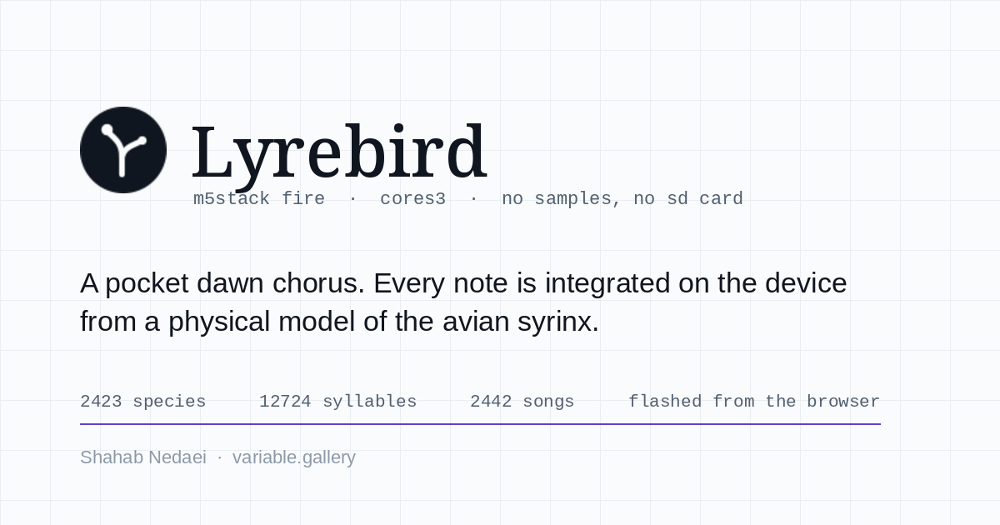
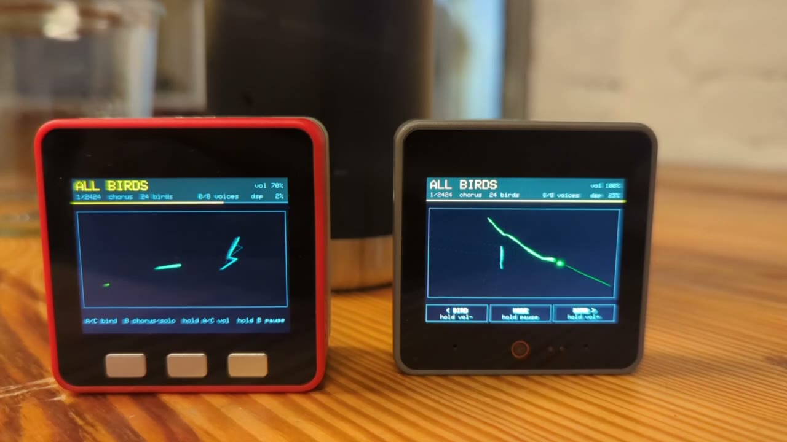
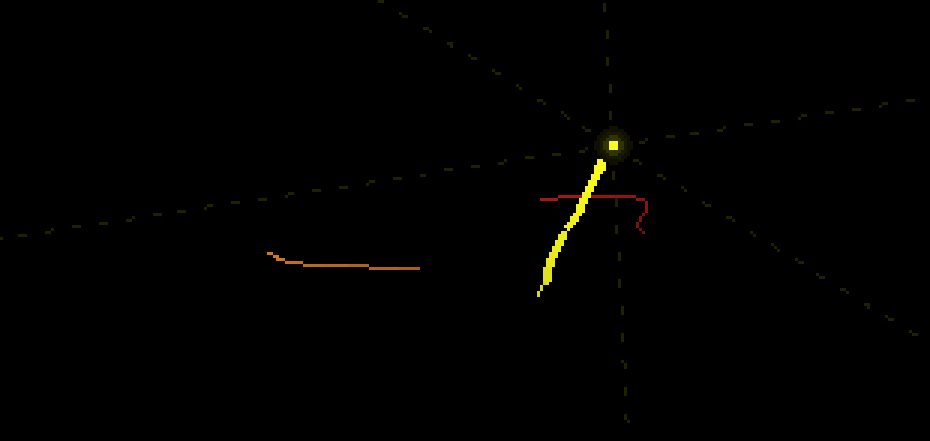

<p align="center">
  
</p>

<h1 align="center">Lyrebird — M5Stack Fire &amp; CoreS3</h1>

<p align="center">
  <b>A pocket dawn chorus.</b> 2423 songbird species, synthesized on the device by a physical
  model of the avian syrinx.<br>No samples, no SD card, no network.
</p>

<p align="center">
  <a href="https://m5lyrebird.variable.gallery">Flash it from the browser</a> ·
  <a href="#flashing">Flashing</a> ·
  <a href="#controls">Controls</a> ·
  <a href="#the-galaxy--the-pages-cloud-and-the-boards-arms">The picture</a> ·
  <a href="#technical-notes">Technical notes</a> ·
  <a href="HANDOFF.md">HANDOFF</a>
</p>

<p align="center">
  
  
  
  
</p>

---

<p align="center">
  <a href="web/static/lyrebird-boards.mp4">
    
  </a>
  <br>
  <sub><b><a href="web/static/lyrebird-boards.mp4">▶ 28 seconds of both boards, with sound</a></b>
  — the Fire on the left with its three buttons, the CoreS3 on the right with the same three
  as touch zones. Nothing in this clip is a render.</sub>
</p>

The device boots into **all birds**: a rolling sample of twelve species, two individuals of
each, arriving as a Poisson process, with a 25 % chance a conspecific answers. The sample
turns over about every four minutes, so the slot is a tour of the corpus rather than a fixed
dozen. Stepping the dial takes you down to one species at a time.

Both boards put a camera inside the corpus, close in, and follow whoever is singing. A song
draws itself as a thread of stretched dots — fat where the note is loud, pinched where it is
quiet, with a haloed bead at the note being sung right now — and a cross of very faint
dashed rules is struck through the singing bird and runs off every edge of the screen. When
another bird takes over, the camera pans across and dollies in. Nothing is drawn for a
bird until it sings, so the screen shows only what is happening and goes black when
nothing is.

<p align="center">
  
  <br>
  <sub>Two birds mid-song, at 310 × 147 px. Drawn by <code>tools/preview_galaxy.py</code> on a
  desktop, colour quantised to the panel's 5/6/5 bits — <b>not a photograph of hardware.</b></sub>
</p>

The sweeping spectrogram is still in the tree, and it is what you get with
`LYREBIRD_UI_GALAXY` at 0 — every active voice plotted at its pitch on a log axis, contours
drawing themselves as the notes play — because it answers a question the arms do not. Both
boards ship with the flag at 1.

Every piece of text is in one block at the top — name, then mode, then load, with volume as
the block's bottom edge — so the picture gets the rest of the screen.

Paused for a minute and the board turns itself off. On the Fire, note that the red button
shuts down on **two short presses**, not a long one, and only on battery: M5Unified
programs the IP5306 that way. See HANDOFF.md.

This is an embedded port of the [Lyrebird](https://github.com/sha5b/Lyrebird) web app's
synth engine (`app/src/lib/audio/worklets/syrinx-processor.js`) and chorus logic
(`app/src/lib/audio/engine.ts`, `individual.ts`). The webflasher stack is copied from
[CYD-Physarum](https://github.com/sha5b/CYD-Physarum).

## Controls

| Button | Short press | Hold |
|--------|-------------|------|
| A      | previous position on the dial | volume down |
| B      | chorus ↔ solo | pause / resume |
| C      | next position on the dial | volume up |

A and C step one dial of `SPECIES_COUNT + 1` positions, and it wraps:

| Position | What sings |
|----------|------------|
| 1 | **all birds** — a rolling 12-species sample, 2 individuals each, ~34 songs/min. Boots here. |
| 2 – 2424 | one species, roster of 4 individuals |

On the CoreS3 there are no physical buttons — the same three are touch zones
drawn along the bottom of the screen, labelled with both actions.

B toggles **chorus** (the roster answering each other, ~12 songs/min) against **solo**
(one bird, that species' songs back to back). Position 1 is a chorus by definition, so B
does nothing there.

The dial steps one position per press and has no search, so a named species deep in the
corpus is not reachable by hand. What is reachable is the all-birds slot, which brings the
corpus past you on its own.

## Flashing

### From the browser

**[m5lyrebird.variable.gallery](https://m5lyrebird.variable.gallery)** — plug the board in
and click through. Chrome, Edge or Opera only, because it needs Web Serial. To run the same
page locally: `cd web && npm install && npm run dev`.

The page flashes the merged images in `web/static/firmware/`, which are **not** a product
of `pio run` — `./scripts/build-firmware.sh` writes them. So a firmware change is not on
the page until that script has run, and a successful `pio run` proves nothing about what
the page will install. Check the timestamps before believing a symptom.

- **Fire**: connect the cable and click through. The board resets itself into its
  bootloader over the cable; the screen blanking a few times is that, not a fault.
- **CoreS3**: put it into download mode *first* — hold the side reset button for
  2–3 s until the green LED lights, then release — and pick the
  `USB JTAG/serial debug unit` entry. It has no UART bridge, so resetting it into
  the ROM swaps one USB device for another and the browser loses the port it was
  given. This is needed **only the first time**: Lyrebird uses the chip's own
  USB-Serial-JTAG, whose identity survives a reset, so afterwards it reflashes
  from the browser like any other board.

### From the command line

```bash
pio run -e m5stack-fire   -t upload
pio run -e m5stack-cores3 -t upload
```

or with the merged images:

```bash
./scripts/build-firmware.sh
esptool.py --chip esp32   write_flash 0x0 web/static/firmware/lyrebird-fire.bin
esptool.py --chip esp32s3 write_flash 0x0 web/static/firmware/lyrebird-cores3.bin
```

## Layout

```
platformio.ini            envs m5stack-fire (ESP32) and m5stack-cores3 (ESP32-S3),
                          both on M5Unified
partitions.csv            factory-only, 3 MB app, no OTA
assets/                   vendored Lyrebird authored inventory + calibration JSON
                          (CC BY-NC-SA 4.0). The shipped corpus is generated from the
                          parent repo — see "Technical notes"
tools/generate_assets.py  JSON -> include/bird_data.h + include/calibration.h
tools/generate_galaxy.py  include/bird_data.h -> web/src/lib/corpus.ts +
                          include/galaxy_data.h, one layout for both screens
tools/preview_galaxy.py   draws the band to a PNG on this machine
tools/verify_syrinx.py    host check of the synth's shortcuts against the closed forms
tools/make_og_card.py     web/static/og-card.png, with the figures read out of the
                          generated headers so the card cannot drift
include/, src/            firmware: syrinx synth, chorus, UI, the band both boards
                          draw (galaxy.cpp), and one audio backend per board
                          (audio_dac.cpp / audio_spk.cpp)
scripts/build-firmware.sh merged 0x0 image + manifest into web/static/firmware/
web/                      SvelteKit + esptool-js webflasher (from CYD-Physarum)
web/src/lib/galaxy.ts     the page's backdrop: the corpus as a point cloud
web/src/lib/seo/          title, card, JSON-LD graph, og:video; robots.txt,
                          sitemap.xml and llms.txt sit in web/static/ beside the icons
web/static/lyrebird-boards.mp4
                          28 s of both boards running, with sound — plus its poster
                          and a caption track. The page's hero and this file's
docs/band-preview.png     what the band looks like, from preview_galaxy.py
```

## The galaxy — the page's cloud and the board's arms

CYD-Physarum's flasher runs the same simulation its panel runs. The equivalent here could
not be the spectrogram: that is a picture of one moment, and page-sized it is a strip of
noise. So both screens borrow the parent project's *other* picture — the corpus arranged in
space, every one of the 12724 syllables with a place of its own.

`tools/generate_galaxy.py` reads `include/bird_data.h`, the same header the firmware sings
from, and works that arrangement out **once**, into two files:

```bash
python3 tools/generate_galaxy.py   # after generate_assets.py
```

| | |
|---|---|
| `web/src/lib/corpus.ts` | for the page's backdrop, base64, 54 KB packed |
| `include/galaxy_data.h` | for the board's arms, PROGMEM, 54 KB of flash |

Positions rather than features, computed in the generator, so the board and the page
cannot disagree about where a syllable is. (It also *could* not be kept in step by hand:
the mixing hash reads well in JavaScript and is not reproducible there, because
`h * 0x2545f491` overflows the 53 bits a double holds exactly.) Every species gets an
island on a Fibonacci sphere; inside it, pitch, duration and contour sweep place the mark.

The two renderers then draw different things, because a page and a 310 × 147 band are not
the same problem. On paper ([galaxy.ts](web/src/lib/galaxy.ts)) the whole corpus is there —
12724 marks in graphite at low alpha, depth darkening them, three islands answering at a
time in `--signal`. On the band ([galaxy.cpp](src/galaxy.cpp)) drawing the corpus was tried
three times — whole, then as a faint bed, then as the roster of two dozen birds — and every
version had the same fault in a smaller form: at that size the marks are a texture, and the
bird actually singing is four pixels lost inside it. So the band keeps only what a small
screen can hold at a size worth seeing: the song as a thread of beads whose weight is its
envelope, the cross of dashed rules struck through it, and a camera that goes to whoever is
singing. Nothing else — a fourth version added a faint world-space lattice under all of it,
to give the camera something static to move against, and that went the same way as the
roster did.

`prefers-reduced-motion` draws one static frame on the page. `tools/preview_galaxy.py`
re-implements the arm model on the host and writes a PNG, which is how `GROW`, `ZOOM` and
`TWIST_RATE` were chosen without reflashing anything — `GROW` at its first value made every
song a 15 px scribble, `TWIST_RATE` closed each arm into a loop, and `ZOOM` left the song a
squiggle in a large dark rectangle.

## Technical notes

- Boards: the Fire is an ESP32, the CoreS3 an ESP32-S3. Different architectures,
  so two binaries; the flasher reads the chip off the board and picks. Everything
  except the audio backend is shared. M5Unified covers both, including the
  CoreS3's AW88298 amplifier bring-up and the bezel touch strip it presents as
  BtnA/B/C — which is why the button code has no board case in it.
- Audio (Fire): I2S0 built-in DAC mode, DMA-paced at 22050 Hz. The Fire's speaker amp
  hangs off DAC1 = GPIO25, which is the I2S "left" DAC channel. (The part is analog-in —
  M5Unified has this board as `use_dac = true, pin_data_out = GPIO_NUM_25`. It is not the
  NS4168 earlier comments named; that is an I2S part.) The DAC
  reads the MSB of each 16-bit DMA slot, unsigned — mid-level is 0x8000. When
  paused, the DAC is disabled to keep the amp silent. 8 bits is a hard -48 dB
  noise floor, so the output is rounded with TPDF dither and first-order noise
  shaping — and gated off entirely over digital silence, because dither with no
  signal under it is just hiss.
- Audio (CoreS3): 16-bit PCM into M5Unified's Speaker, which owns the I2S and the
  AW88298's I2C setup. No DAC on the ESP32-S3, so none of the 8-bit machinery
  above applies.
- Synth: float32 port of the browser worklet. Envelope path, timbre classes
  (pure/reed/buzz), attack/hold, AM, vibrato, harmonic band, and the detuned
  second syringeal side (`two`). The respiration, two-voice coupling, formant,
  noise, rough and fricative paths are not ported — no authored syllable uses them.
  8 voices max, 16–64 Euler substeps per sample.
- Synth CPU: the calibration tables are indexed arithmetically rather than searched.
  `CAL_INV_F0_GRID` is geometric, `CAL_PRESSURE_GRID` uniform, and `CAL_BETA_GRID`
  uniform in three runs, so `betaForF0` and `ampPP` are O(1) per sample instead of a
  192-entry binary search plus an ~85-step linear scan. The envelope and the AM
  oscillator are incremental, and the pitch contour moves to a 32-sample control block
  with a per-sample ramp. There is no libm call left in the sample loop. See the header
  comment in `src/syrinx.cpp` for why: the old cost overran the I2S DMA, and a late DMA
  buffer is an audible click.
- Verification: `python3 tools/verify_syrinx.py` checks the synth's control-rate and
  incremental paths against the closed forms they replaced — the envelope, the AM and
  vibrato oscillators, the tanh approximation, the O(1) table indexing against the old
  scan and binary search, and the residual pitch error in cents. No dependencies.
  **Four of those checks currently fail on the shipped 2423-species corpus** and all of
  them pass on the authored twelve: the shortcuts were tuned against 44 syllables and the
  corpus reaches parameter ranges those never did. The figures and what they mean are in
  [HANDOFF.md](HANDOFF.md#verification--and-what-it-now-says) — the envelope error is the
  one that matters.
- Data: the whole Lyrebird corpus — 2423 species, 12724 syllables, 2442 songs — plus the
  offline beta/ampPP calibration tables, compiled in as PROGMEM headers. That is 4.0 MB of
  generated C, which lands as 1.79 MB of flash (of a 3 MB app partition) and no RAM at all,
  since the tables are `rodata` and are read where they lie. `assets/` vendors the authored
  twelve and the calibration; the corpus itself is not vendored, so regenerating the
  committed header needs the parent repo beside this one:

  ```bash
  python3 tools/generate_assets.py --inventory ../Lyrebird/data/learned-inventory-final.json
  ```

  Plain `python3 tools/generate_assets.py` builds from `assets/inventory.json` instead and
  gives a 12-species firmware.

## Licence and credits

CC BY-NC-SA 4.0, matching the [Lyrebird](https://lyrebird.variable.gallery) project it is
derived from. The bird data in `assets/` and the generated headers come from that project
and carry the same licence, and so does the mark: `web/static/favicon.*`,
`apple-touch-icon.png` and `icon-*.png` are its brand files, a syrinx dividing into two
unequal bronchi — the mechanism every note here is integrated from.

Recordings behind the corpus are from xeno-canto and iNaturalist. The parent project's
pipeline describes each one as numbers and deletes it; **no audio is redistributed by
either project**, and none is shipped in this firmware.

By [Shahab Nedaei](https://shahabnedaei.variable.gallery) · [variable.gallery](https://variable.gallery)
